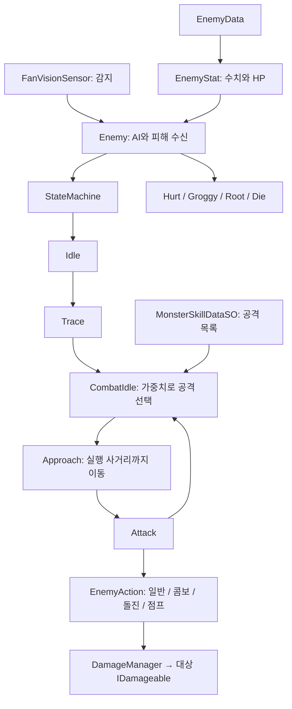

# 몬스터 구조 점검 및 개선안

점검일: 2026-09-16. Unity 6000.3.10f1 프로젝트의 스크립트와 저장된 에셋 기준입니다. 플레이 모드 검증과 Profiler 측정은 수행하지 않았습니다.

## 현재 구조

- `Enemy`는 감지 결과, 피격 어그로, 상태 머신, 공격 쿨타임, 이동 잠금, 피해·사망 이벤트를 관리합니다.
- `EnemyStat`는 `EnemyData`에서 수치를 읽고 HP 및 버프 계산을 보관합니다.
- `MonsterSkillDataSO`는 공격 목록이며, 각 `MonsterSkillData` 파생 에셋이 실행용 `EnemyAction`을 생성합니다. 공유 SO에 실행 타이머를 저장하지 않는 점은 유지할 가치가 있습니다.
- 일반/콤보 공격은 시간에 따라 물리 겹침 검사를 하고, 돌진은 NavMeshAgent 이동, 점프는 Agent를 끄고 Transform을 이동한 뒤 복구합니다.
- `PoiseHandler`는 강인도와 그로기 예약을, `ParryEventBus`는 공격 객체별 패링 예고를 관리합니다.
- `Boss → OsalsinBoss` 확장은 존재하지만 페이즈·보호막·스킬셋 교체 연결은 미완성입니다.

## 이번에 수정한 문제

| 문제 | 변경 |
|---|---|
| 상태에서 예고 시간만큼 대기한 뒤 액션에서 다시 예고/선딜이 시작됨 | Attack 진입 시 액션을 시작하고 예고 시간은 액션이 관리하도록 정리 |
| 피격·사망으로 끊긴 공격의 `IsFinished`가 false로 남아, 그 공격을 패링한 플레이어가 공격 종료를 계속 기다릴 수 있음 | 액션 Exit에서 완료·비활성 상태로 변경. 진입 여부를 `IsActive`로 추적 |
| 적 비활성화 시 패링 예고, 공격의 임시 상태, 넉백이 정리되지 않음 | OnDisable에서 활성 액션 종료, 선택 초기화, 예고 및 넉백 정리 |
| 낮은 프레임률/높은 공격 속도에서 짧은 일반·콤보 타격 구간을 통째로 건너뜀 | 이전 시간과 현재 시간 사이에 판정 구간을 통과했는지도 검사 |
| 일반 공격은 `hitDuration`이 있어도 최초 한 프레임만 검사함 | 유효 구간 동안 검사하고 타수별 HashSet으로 같은 대상의 중복 피해 방지 |
| 구 필드명 `excuteRange`가 남은 에셋의 실행 사거리가 유실됨 | `FormerlySerializedAs` 추가. 돌진 10, 점프 25 등 기존 저장값을 읽도록 연결 |
| 사망 후에도 센서와 이동 애니메이션 계산을 매 프레임 수행함 | 사망 상태 진입 처리를 한 뒤 해당 AI 계산 중지 |
| 사망 시 루트 Collider 하나만 끄며, 루트 Collider가 없으면 예외 발생 | 해당 Enemy가 소유한 자식 Collider도 비활성화. 별도 자식 Enemy의 Collider는 제외 |
| 사망 직후 넉백 코루틴이 계속 진행될 수 있음 | 사망 시 넉백 종료 |
| 타깃을 잃고 Idle로 돌아가도 이전 이동 경로가 남을 수 있음 | Idle 진입 시 NavMesh 경로 초기화 |
| 센서 레이를 1개로 설정하면 정면이 아닌 부채꼴 왼쪽 끝을 검사함 | 실제 검사와 Gizmo 모두 정면으로 수정 |
| 공격 선택 때마다 후보 List를 새로 할당함 | 상태 객체가 후보 목록을 재사용 |
| 돌진 공격의 애니메이션 재생 호출이 TODO로만 존재함 | 이름이 지정된 경우 재생. 현재 이름이 빈 에셋은 호출하지 않음 |

씬/프리팹/SO 수치는 직접 수정하지 않았습니다. 다만 사거리 필드 호환이 복구되어 기존 저장값이 실제 AI 동작에 반영됩니다.

### 동작 변화와 확인할 점

- 중복 대기가 제거되어 몬스터 공격 모션이 이전보다 빨리 시작됩니다. `hitStartTime`, `startupTime`은 액션 시작 기준으로 확인해야 합니다.
- 일반 공격의 유효 구간 도중 들어온 대상도 맞습니다. 회피/무적으로 무효화된 대상은 기존과 동일하게 해당 타수에서 재시도하지 않습니다.
- 프레임을 건너뛴 타격 검사는 현재 위치에서 수행됩니다. 과거 무기 궤적을 재구성하는 연속 충돌 검사는 아닙니다.
- `telegraphDuration`과 첫 타격 시간이 맞지 않는 에셋도 있습니다. 예를 들어 기본 공격 에셋은 예고 0.5초, 타격 시작 0.24초입니다. 패링 안내를 어느 구간까지 유지할지 정한 뒤 에셋별로 조절해야 합니다. 콤보 전체를 예고하는 정책과 첫 타격만 예고하는 정책을 구분하는 편이 좋습니다.

## 구조 개선 우선순위

### 1. 스탯과 상태이상 데이터의 기준 통일

- `Enemy.StaggerResistLevel`과 `EnemyData.staggerResistLevel`이 중복되며 실제 피격 비교는 Enemy 필드를 사용합니다. BlackSlayer는 프리팹 값 2, SO 값 1로 서로 다릅니다. SO를 기본값으로 쓰고 필요한 경우에만 명시적 override를 두는 구성을 권장합니다. 어느 값이 의도인지 확정되지 않아 수치를 자동 변경하지 않았습니다.
- `EnemyStatHandler`를 변경하는 구형 방어 감소/약점 노출 효과와, `EnemyStat`·`FormTargetEffects`를 읽는 현재 `DamageManager`가 분리되어 있습니다. 구형 효과가 다시 연결되더라도 기대한 피해 변화가 생기지 않을 수 있습니다. 방어력 계산과 디버프를 하나의 스탯 경로로 통합하세요.
- HP 변경도 `Enemy.TakeDamage`와 `EnemyStat.TakeDamage`로 나뉘며 후자를 직접 호출하면 사망/강인도/어그로 이벤트를 우회합니다. 외부 피해 진입점은 `IDamageable` 하나로 제한하는 편이 좋습니다.
- Bind/Airborne 등이 같은 `IsRoot` bool을 켰다가 개별 종료 시 끕니다. 서로 겹칠 경우 남은 효과가 있어도 속박이 풀릴 수 있습니다. 효과별 토큰 또는 활성 효과 수로 이동 불가 여부를 계산하세요.

### 2. 보스 기능 완성

- `Boss.TakeDamage` 재정의가 주석 처리되어 페이즈의 피해 보정과 보호막 흡수가 실제 피해 경로에 연결되어 있지 않습니다.
- `CheckPhaseTransition`은 현재 Start에서만 호출되어 HP 변화에 따른 전환이 연결되지 않습니다.
- `BossPhaseBase.OnEnter`의 스킬셋 교체도 주석 상태입니다.
- 페이즈/보호막 API는 int, 현재 피해 API는 float로 타입도 다릅니다.
- 먼저 일반 적과 공통인 피해 결과 계약을 유지하는 보스 처리 순서를 정하고, 페이즈 전환/보호막/스킬셋 교체를 함께 검증해야 합니다. `_Project`의 저장된 씬·프리팹에서는 OsalsinBoss 스크립트 GUID 참조가 검색되지 않았습니다. 미완성 보스를 이번 수정에서 임의 활성화하지 않았습니다.

### 3. 감지와 전투 기억의 분리

`FanVisionSensor`는 감지 실패 시에도 기존 타깃을 유지합니다. 추적 기억으로는 쓸 수 있으나 “지금 보이는 대상”과 “기억 중인 대상”이 혼재합니다. 현재 시야, 마지막 발견 위치, 추적 유지 시간을 분리하면 벽 뒤나 시야 밖으로 이동한 플레이어에 대한 동작을 명확히 설정할 수 있습니다.

레이를 부채꼴로 띄엄띄엄 쏘는 구조라 레이 사이의 플레이어를 놓칠 수도 있습니다. 플레이어 후보의 거리·각도를 먼저 확인하고 후보를 향해 장애물 검사를 하는 구조를 검토하세요.

### 4. 공격 제작과 검증을 에디터 중심으로 개선

- 일반/콤보의 모션 타이밍은 Animation Event 또는 공통 타임라인 데이터로 제작하면 모션과 판정의 수동 동기화 부담이 줄어듭니다.
- SO의 이름이 빈 애니메이션, 0 이하 공격 속도, 공격 길이 밖의 타격 시점, 유효하지 않은 사거리 등을 Inspector에서 검증하도록 하세요.
- Combo/Dash SO의 `hitBoxShape`는 현재 실행 코드에서 사용하지 않고 Sphere만 검사합니다. Sphere만 지원한다고 명확히 표시하거나, 크기/높이까지 포함한 공통 히트박스 정의로 통합해야 합니다.
- `StateMachine`은 적도 `IPlayerState`를 사용합니다. 동작 오류는 아니지만 공용 `IState`로 이름과 위치를 정리하면 의존 관계가 명확해집니다.
- `Enemy`에서 상태 구성과 이동 제어를 분리할 수 있습니다. 다만 현재 SO + 실행 객체 분리는 유지하면서 점진적으로 정리하는 편이 적합합니다.

## 최적화 제안

다음 항목은 Profiler 측정 전의 후보이며 실제 성능 향상 수치를 확인한 것은 아닙니다.

1. **타격 검사 버퍼 재사용:** `Physics.OverlapSphere/Box/Capsule`의 배열 할당을 NonAlloc 계열로 변경. 버퍼가 가득 찼을 때 확장/재검사하여 대상이 조용히 누락되지 않도록 합니다. 일반 공격을 구간 검사로 수정했으므로 이 부분의 우선순위가 높습니다.
2. **경로 갱신 주기 제한:** Trace/Approach가 매 프레임 `SetDestination`을 호출합니다. 예를 들어 0.1~0.2초 주기와 목표 위치 변화량을 조합하고, 첫 진입에는 즉시 경로를 요청하세요. 공격 직전의 반응성은 별도로 검증해야 합니다.
3. **감지 주기 분산:** 먼 적은 감지 주기를 늘리고 여러 적의 검사 프레임을 분산합니다. 전투 중 공격 타격 판정까지 같은 낮은 주기로 늦추지는 마세요.
4. **사망 개체 반환:** 현재 사망 상태에는 Destroy/풀 반환이 없습니다. 사망 애니메이션과 보상 처리가 끝난 뒤 반환하는 수명 주기를 마련하세요. 풀링 시 HP/강인도/상태/Collider/Agent/타깃/쿨타임 전체를 초기화해야 합니다. 이번 OnDisable 정리만으로 완전한 풀링이 지원되는 것은 아닙니다.
5. **측정 후 캐싱 확대:** NavMeshAgent, PoiseHandler 등의 반복 GetComponent와 문자열 Animator 파라미터는 캐싱 후보입니다. 우선 다수 몬스터 장면에서 물리 검사, 경로 계산, GC Alloc 비중을 확인하세요.

공식 참고:

- [NavMeshAgent.SetDestination](https://docs.unity3d.com/6000.3/Documentation/ScriptReference/AI.NavMeshAgent.SetDestination.html): 목적지 설정은 경로 계산을 요청하며 결과가 준비되기까지 시간이 걸릴 수 있습니다.
- [Physics.OverlapSphereNonAlloc](https://docs.unity3d.com/6000.3/Documentation/ScriptReference/Physics.OverlapSphereNonAlloc.html): 제공한 버퍼에 결과를 기록하며, 버퍼를 자동 확장하지 않습니다.

## 검증

- Unity 설치에 포함된 Roslyn 컴파일러와 프로젝트의 실제 Assembly-CSharp 응답 파일/참조 DLL로 전체 게임 스크립트 컴파일 통과. 출력은 임시 폴더로 분리하여 Unity의 빌드 산출물을 덮어쓰지 않았습니다.
- 기존 `PoiseHandler.OnPoiseBreak` 미사용 이벤트 경고 1건이 남습니다.
- 컴파일된 실제 어셈블리의 공통 타격 구간 함수를 호출해 10가지 경계 검사를 통과했습니다: 구간 이전, 시작 경계, 구간 내부, 전체 구간 건너뜀, 구간 이후, 길이 0, 음수 길이, 정지된 시간, 0초 타격, 종료 경계.
- 관리 코드만 실행하는 검사로 액션 Exit 후 완료/비활성 상태와 이전 사거리 필드명 호환 메타데이터를 확인했습니다. 총 12개 검사 통과. Unity 물리나 애니메이션을 실행한 테스트는 아닙니다.
- `git diff --check` 통과.
- Unity 자동화 서버 연결 실패로 실제 플레이, NavMesh 복귀, 화면 연출, 패링 연계는 미검증입니다.

권장 플레이 확인: 일반 공격 유효 구간 중 진입, 저FPS에서 콤보 타수 유지, 패링 후 몬스터 피격 중단, 공격 예고 중 비활성화, 점프/돌진 중 사망, 자식 Collider가 있는 적의 사망, 타깃 소실 후 정지, 레이 1개인 센서의 정면 감지, 돌진/점프 실행 사거리.
